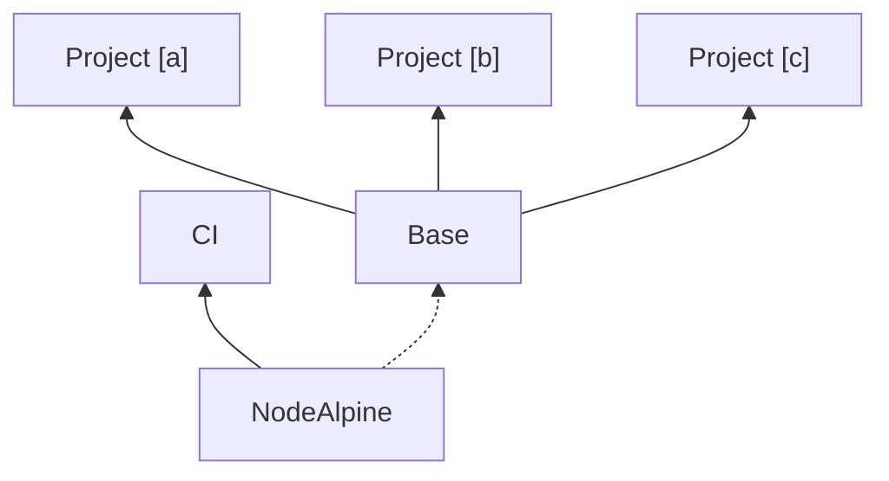

## Design

Note: I'm not currently sure which image Base is instantiated by.




## Helpful commands

```
# Run as CI when developing locall (sharing current repo code)
docker run --rm -it -v ${PWD}:/opt/atlassian/bitbucketci/agent/build atlassian/default-image

# docker build "$(npm config get cache)" -f ./Dockerfile.base -t bordellio/build-base:latest
```
